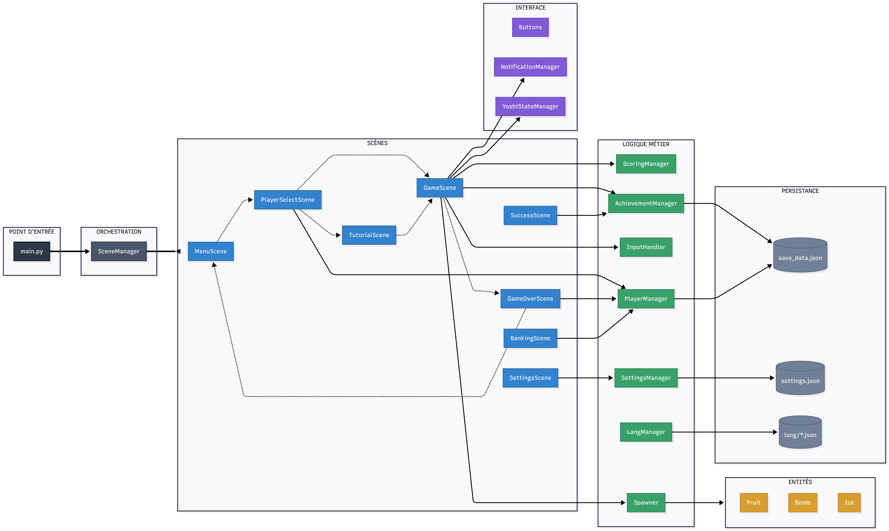
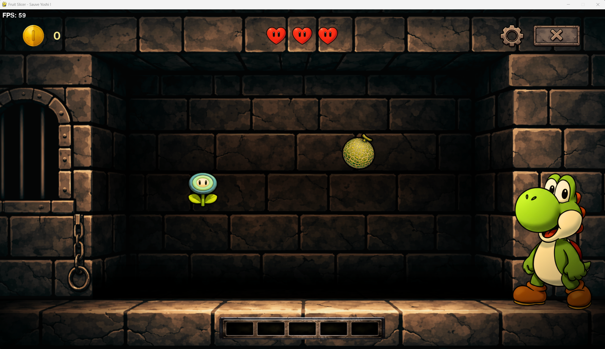
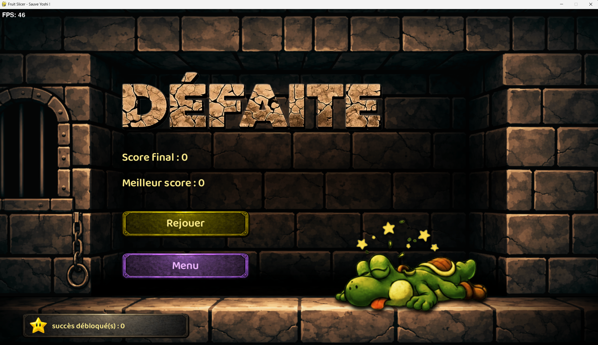

# 🦖 Fruit Slicer - Sauve Yoshi !

Jeu de type Fruit Ninja développé en Python/Pygame dans le cadre d'un projet pédagogique à **La Plateforme**.

---

## Présentation

Yoshi est affamé ! Tranchez les fruits pour le nourrir, évitez les Bob-ombs, et utilisez les Fleurs de glace pour ralentir le temps.

| Mode Classique | Mode Challenge |
|----------------|----------------|
| 3 vies, survie | 60 secondes, scoring |
| Bombe = Game Over | Bombe = -10 points |
| Glaçons disponibles | Pas de glaçons |

**Contrôles disponibles :**
- **Clavier** : Typing game (appuyer sur la lettre affichée)
- **Souris** : Tracer pour trancher (style Fruit Ninja)

---

## Installation
```bash
git clone https://github.com/stepanmereniuk-dev/fruit-slicer.git
cd fruit-slicer
pip install -r requirements.txt
python main.py
```

**Prérequis :** Python 3.8+, Pygame 2.0+

---

## Architecture
```
fruit-slicer/
├── main.py                 # Boucle principale
├── scene_manager.py        # Gestion des écrans
├── config.py               # Configuration
│
├── scenes/                 # 8 écrans (menu, game, settings...)
├── core/                   # Logique métier (scoring, achievements...)
├── entities/               # Fruit, Bomb, Ice, Splash
├── ui/                     # Boutons, HUD
└── assets/                 # Images, sons, polices, traductions
```

**Pattern principal :** Architecture à deux orchestrateurs
- `main.py` → Runtime (Pygame, boucle, events)
- `SceneManager` → Navigation entre écrans

---

## Fonctionnalités

- 2 modes de jeu (Classique / Challenge)
- 2 modes de contrôle (Clavier / Souris)
- 3 niveaux de difficulté
- 38 succès à débloquer
- Système de high scores par joueur
- Support multilingue (FR / EN)
- Tutoriel intégré pour nouveaux joueurs

---

## Diagramme UML



---

## Aperçus






---

## [](https://forthebadge.com)

| Membre | Rôle |
|--------|------|
| Noémie | Architecture, SceneManager, Settings, Audio |
| Stepan | GameScene, Spawner, Scoring, Entités |
| Guillaume | Achievements, SuccessScene, RankingScene |

---

## Ressources

- [Documentation Pygame](https://www.pygame.org/docs/)
- Inspiration : Fruit Ninja (Halfbrick Studios)
- Direction artistique : Univers Nintendo / Yoshi's Island

---

*Projet pédagogique — La Plateforme*